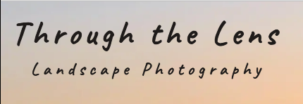
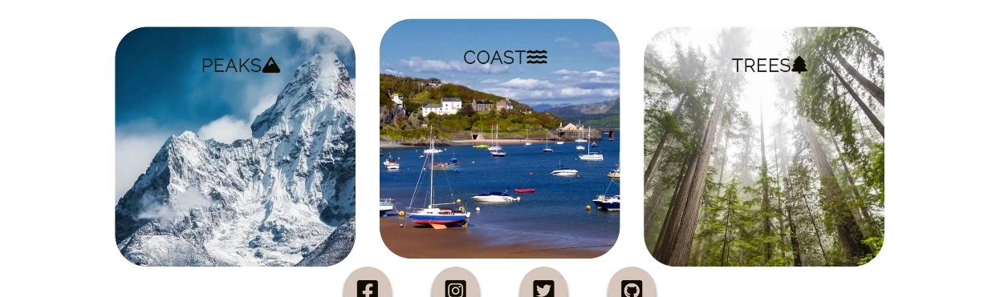
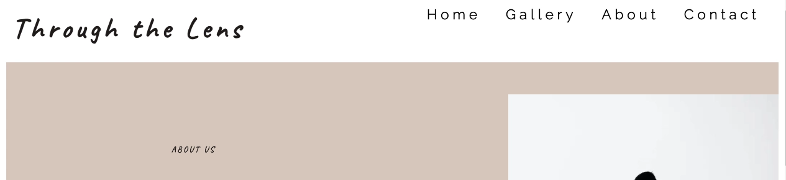
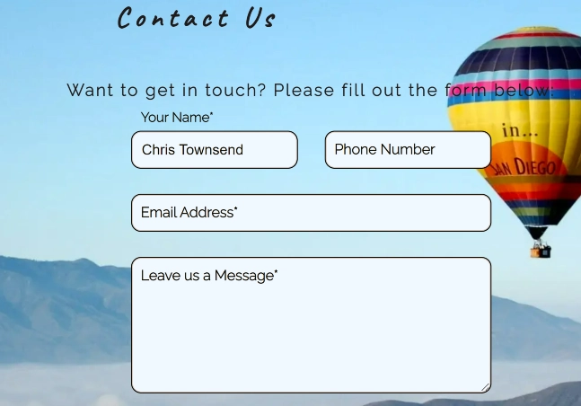
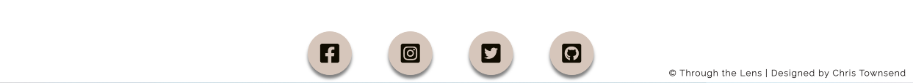

<h1 align="center">Portfolio Project One - HTML/CSS Essentials</h1>

## Live Site
[Through the Lens - Landscape Photography](https://chris-townsend.github.io/project-one/index.html)

#

## Repository
[https://github.com/chris-townsend/project-one](https://github.com/chris-townsend/project-one)

***

## Contents
- [Objective](#Objective)
- [Brief](#Brief)
- [User Experience(UX)](#user-experience-ux)
- [Design](#Design)
    - [Colour Scheme](#Colour-Scheme)
    - [Typography](#Typography)
    - [Imagery](#Imagery)
- [Wireframes](#Wireframes)
- [Features](#Features)
    - [Features Left to Implement](#Future-Features)
    - [Languages Used](#languages-Used)
- [Technologies Used](#programs-frameworks--libraries-used)
- [Testing](#Testing)
    - [Testing Stories for UX](#testing-user-stories-from-user-experience-ux-section)
    - [Further Testing](#Further-Testing)
- [Bugs](#Known-Bugs)
- [Deployment](#Deployment)
    - [GitHub Pages](#GitHub-Pages)
    - [Forking the GitHub Repository](#forking-the-github-repository)
    - [Making a local Clone](#making-a-local-clone)
- [Credits](#Credits)
    - [Content](#Content)
    - [Media](#Media)
    - [Acknowledgements](#Acknowledgements)

***

## Objective
#
In this project I intend to provide a portfolio style website to showcase some of the best Landscape photography prints. It will also contain a styled form on a contact page. The main objective is to demonstrate competency in HTML and CSS. I hope to provide an emotive, static front end application which is clearly laid out and easy to navigate. 

**The needs within this project are not genuine and is made only for the purpose of completing my Code Institute PP1 project**

***

## Brief
#
- The goal of the website is to showcase Chris's landscape photography prints with the potential for users to contact the publisher if neccesary by using the contact form provided
- The website will have an about page which will contain infomation about the author and also a team section with information about employees.
- It will display a small gallery
- Links to wiki pages to show information on how the website was created, using HTML, CSS & GitHub 
- Fixed social media links at the bottom of the screen

***

## User Experience (UX)
#

-   ### User Requirements

    -   #### First Time Visitor Goals

        1. As a First Time Visitor, I want to easily understand the main purpose of the site and understand what it's about.
        2. As a First Time Visitor, I want to be able to easily navigate throughout the site to find content easily.
        3. As a First Time Visitor, I want to easily be able to locate their social media links to see their followings to determine how trusted and known they are.

    -   #### Returning Visitor Goals

        1. As a Returning Visitor, I want to find the best way to get in contact with the organisation.

        2. As a Returning Visitor, I want to find the location of where the organization is.

    -   #### Frequent User Goals

        1. As a Frequent User, I want to check to see if there has been any new photos recently added.
        2. As a Frequent User, I want to get hold of the organization.
    
       ***

-   ### Design
#
-   #### Colour Scheme
    
     -   The main colours used are Eerie Black, Smokey Black and White with the homepage and contact page containing a hero image.
     - The About page has a background colour of Pale Silver which I think works well with the image.
     - I used Alice Blue for the background colour of the form on my contact page.

    I kept the colour scheme neutral to give the website a formal and professional look. The absence of any color allows better focus on the main content without any distracting elements. 

    

    ***
    -   #### Typography
    #
    The fonts are imported into the CSS file from *[Google Fonts](https://fonts.google.com/)* 
    - The **Raleway** font is the main font used throughout the whole website with **Sans Serif** as the fallback font in case for any reason the font isn't being imported into the site correctly. **Raleway** is an elegent **sans-serif** typeface family which makes the text look bold and personable.
    
    - For the main headings I have used the **Caveat** font, with **Sans Serif** as a fallback font. Its a hand-writing type family which gives the website a friendly appearence.
    

    ***
         
    -   #### Imagery
    #
    -   Imagery is important through out the website, especially on the homepage and gallery page. The large, background hero image is designed to be striking and catch the user's attention when they first vist the site. It has a modern and bright aesthetic. All of the images have been compressed using *[Compressor.io](https://compressor.io/)* to reduce size and load times.

    
    
    ***

*   ### Wireframes
#

-   Home Page Wireframe for desktop -
    

- Gallery Page Wireframe for desktop - 
    

- About Us Page Wireframe for desktop - 
    

-   Contact Us Page Wireframe for desktop -
    

-   Mobile Wireframe Home page -

     

      -   Mobile Wireframe Gallery page -

     

      -   Mobile Wireframe About page -

     

      -   Mobile Wireframe Contact page -

     

***    

## Features
#
The design is made with mobile first in mind, the media queries in the CSS file are done in a way to keep the structure and responsiveness in place as the screen size decreases. 

I have used [Responsinator](http://www.responsinator.com/) to check the responsiveness on different devices. The site is responsive on all devices available inluding ios devices. I have also added extra media queries for screen sizes 360px wide. 

 - [Responsinator Results](http://www.responsinator.com/?url=chris-townsend.github.io%2Fproject-one%2Findex.html)
#
-   Interactive elements

1. I have tried to make the majority of the site **interative**. When you first arrive on the homepage, the main headings "Through the Lens and "Landscape Photography" flash up and grow on the screen over 1.5 seconds. This has been accomplished by using *keyframes* with *image-grow*.

2. The navigation bar at the top of the page has been made **interative** by using the *hover* function, this allows users to easily navigate the site.

    

3. The quote box below the hero image on the homepage has added **animation**, it grows from a scale of 0.2 to 1 over 8 seconds. I made the **animation** to grow over 8 seconds so that it allows more time to see the **animation** before the reader scrolls down the page.

4. Below the quote section on the homepage is three gallery cards which take you to the gallery page when clicked. When you *hover* over the cards they become **interative**, this has been accomplished by using the *hover*: *transform* function.

5. The social media icons that have been fixed to the bottom of the screen have been made **interative** by using the *hover*: *transform* function. I have used a background colour and box shadow for when an icon is hovered over. Each icon has been assigned its own personal color by using [Social Colours](https://materialui.co/socialcolors/).

6. The headings for the gallery, about and contact page have been made **interactive**. Similar to the main heading, I have used the *image-grow* *keyframes* function. 

7. I wanted to make my gallery images stand out by adding **animation**. I accomplished this by using the *hover* and *transition* function. When you *hover* over an image it eases in over 0.4 seconds and when you unselect, it goes back to its original state. I used the *transition* ease-in-out for this method.

8. My contact page has been made **interative** so that when you input your details into the form, the headings get pushed out of the box and stay above the input boxes. This was accomplished by using the *hover* and *transition* function. I have added extra style to the submit button by adding in an arrow when you *hover* over it. The form will come up with a "Please fill out this feild" message when it hasn't been filled in correctly. This means that a name and email address is *required* before the form can be submitted. 

- *the contact form is **not currently active** as it requires languages I have yet to learn. The form is there to demonstrate the html structure and CSS style*

9. At the bottom of all pages within my footer I have added a copyright symbol with the organization and who it was created by. It contains information to improve the websites overall usability. 

***
## Future Features
#
- Make the form active on the contact page - The form on the contact page currently does not send any information. The main purpose of my first project is to use CSS and HTML so I have not yet learned about creating the necessary scripting behind the form. The 'action' and 'method' attributes have been removed to prevent any issue with errors.

- A blog page to the site - This would mean revamping the site and adding another page and heading to the nav bar, this gives another reason to attract more users to the site. 

- More gallery pages - I would like to add individual gallery pages for peaks, coast and trees instead of directing you to the same gallery page.

- Add a reset button to my contact form to make it more user friendly. 

- An e-commerce shop section where landscape prints can be bought.

### Languages Used
#

-   [HTML5](https://en.wikipedia.org/wiki/HTML5)
-   [CSS3](https://en.wikipedia.org/wiki/Cascading_Style_Sheets)

### Programs, Frameworks & Libraries Used
#

- [Balsamiq:](https://balsamiq.com/) Balsamiq was used to create the wireframes during the design process.

- [Pixlr:](https://pixlr.com/x/) Pixlr was used to resize and change the format of my images.

- [Coolors:](https://coolors.co/) Coolors was used to pick a colour scheme and check contrast. 

- [TinyPNG:](https://tinypng.com/) All images within the project have been processed through their free compression tool.

- [Hover.css:](https://ianlunn.github.io/Hover/) Hover.css was used on the Social Media icons in the footer to add the float transition while being hovered over.

- [Google Fonts:](https://fonts.google.com/) Google fonts were used to import the 'Raleway' and 'Caveat' font into the style.css file which is used on all pages throughout the project.

- [Font Awesome:](https://fontawesome.com/) Font Awesome was used throughout the website to add icons for aesthetic and UX purposes.

- [Google DevTools:](https://developer.chrome.com/docs/devtools/) Once the website was made to a basic deployment level, Google DevTools was used frequently to resize objects within the site, very helpful for making my website responsive.

- [Git](https://git-scm.com/) Git was used for version control by utilizing the Gitpod terminal to commit to Git and Push to GitHub.

- [GitHub:](https://github.com/) GitHub is used to store the projects code after being pushed from Git.

- [W3C Markup Validator:](https://validator.w3.org/) This site was used to ensure that my HTML and CSS was error free. I had to push my code to ensure it was updated and then add the URL of the website to the address bar which then checked for errors or warnings.

 - [Slack:](https://slack.com/intl/en-gb/) Slack is a an online messaging service which allows poeple to collaberate with their workspaces. Slack was incredibly useful for advice from students and tutors.

 - [YouTube:](https://www.youtube.com/) YouTube is a free video sharing website, it has been very useful for watching videos on positioning using flexbox. 

## Testing
#

The W3C Markup Validator and W3C CSS Validator Services were used to validate every page of the project to ensure there were no syntax errors in the project. The results are shown below:

-   [W3C HTML Markup Validator](https://validator.w3.org/) Results
### Homepage

### Gallery Page

### About Page

### Contact Page

-   [W3C CSS Markup Validator](https://jigsaw.w3.org/css-validator/) Results
### Homepage

### Gallery Page

### About Page

### Contact Page

I have run the entire website through Google Chrome's lighthouse audit application and the results are shown below:

- Mobile
### Homepage

### Gallery Page

### About Page

### Contact Page

- Desktop
### Homepage

### Gallery Page

### About Page

### Contact Page

### Testing User Stories from User Experience (UX) Section
#

-   #### First Time Visitor Goals

    1. As a First Time Visitor, I want to easily understand the main purpose of the site and learn more about the organisation.

        1. Upon entering the site, users are automatically greeted with a clean and easily readable navigation bar to go to the page of their choice. Underneath there is a quote from a famous landscape artist and gallery cards which will take you straight to the gallery page.
        2. The main points are made immediately with the hero image and the title.
        3. The user has two options, click one of the call to action buttons or scroll down.

    2. As a First Time Visitor, I want to be able to easily be able to navigate throughout the site to find content.

        1. The site has been designed to be fluid and never to entrap the user. At the top of each page there is a clean navigation bar, each link describes what page they will end up on clearly.
        2. On the Contact Us Page, after a form response is submitted, the page refreshes and the user is brought to the top of the page where the navigation bar is.

    3. As a First Time Visitor, I want to easily be able to locate their social media links to see their followings to determine how trusted and known they are.
        1. The user will see the social media icons as soon as they open the site as they are fixed to the bottom of the screen. They are also interative when hovered over.
      

-   #### Returning Visitor Goals

    1. As a Returning Visitor, I want to find the best way to get in contact with the organisation with any questions I may have.

        1. The navigation bar clearly highlights the "Contact" Page.
        2. Here they can fill out the form on the page or alternatively they can message the organisation on social media.
        3. The footer contains links to the organisations Facebook, Twitter and Instagram page as well as the organization's Github.
        4. Whichever link they click, it will be open up in a new tab to ensure the user can easily get back to the website.

     2. As a Returning Visitor, I want to see where the location is based.
         1. A contact map is easily accessable by clicking on the contact header on the navigation bar and scrolling to just below the contact form.
        
-   #### Frequent User Goals

    1. As a Frequent User, I want to check to see if there has been any new photos recently added.

        1. The user would already be comfortable with the website layout and can easily locate the gallery page.

    2. As a Frequent User, I want to get hold of the organization.

        1. The user would already be comfortable with the website layout and can easily click the contact link from the homepage and at the bottom of the page is a google map.

        2. On the contact page there is a form which they can fill out, there is a "Submit" button to the bottom of the input field. This is located close to the field and can easily be distinguished. When you hover over the button some arrows appear to acknowedge you are about to submit the form.

### Further Testing
#

-   The Website was tested on Google Chrome, Internet Explorer and Safari browsers.
-   The website was viewed on a variety of devices such as Desktop, Laptop, Oneplus 5t, iPhone SE, iPhone 6-8, iPhoneX & Samsung Galaxy S21.
-   A large amount of testing was done to ensure that all pages were linking correctly.
-   Friends and family members were asked to review the site and documentation to point out any bugs and/or user experience issues.

### Known Bugs
#

-   On some small mobile devices the contact map pushes the size of the screen out more than any of the other content on the page.
    -   A white gap can be seen to the right and above the map. To fix this problem I have reduced the width size of the map as screen size decreases to make it more responsive. On some very small devices, there may still be a small gap but works on majority of devices.

- When testing my code through the W3C validator for the first time, it came up with a lower score for accessability. This was due to not adding having a title attached to my iframe google map, this has now been added.

- I originally had the colour Grey for my writing on my about page. This lowered my accessability score so I changed it back to black to compensate for accessability.

- When testing my site through [Responsinator](http://www.responsinator.com/) The site would occassionally display my nav bar differently at 412px and 414px. When I refresh the page a couple of times it will show it correctly, I'm not quite sure what is causing this and am still unsure now. I have tested the responsiveness using Google DevTools and it is showing up correctly on there at 412px and 414px.  

## Deployment
***

### GitHub Pages
#
The project was deployed to GitHub Pages using the following steps...

1. Log in to GitHub and locate the [GitHub Repository](https://github.com/)

2. At the top of the Repository, locate the "Settings" Button on the menu.
    

3. Select "Pages" from the menu on the left-hand side.

    

4. Under "Source", click the dropdown bar and select "Main Branch" and click save.

5. The page will automatically refresh and will take a short time to publish the page. The page should turn green once the site has been deployed.

6. Scroll back down through the page to locate the published site [link](https://github.com) in the "GitHub Pages" section.

### Forking the GitHub Repository
#

By forking the GitHub Repository you can make a copy of the original repository You can view and/or make changes without affecting the original repository by using the following steps..

1. Log in to GitHub and locate the [GitHub Repository](https://github.com/) you would like to fork.

2. At the top of the Repository, just above the "Settings" Button on the menu, locate the "Fork" Button and you should now have a copy of the original repository in your account.

### Making a Local Clone
#

1. Log in to GitHub and locate the [GitHub Repository](https://github.com/)

2. On the repository main page, click the drop down menu called Code.

    

3. To clone the repository using HTTPS, copy the link.

    

4. Open Git Bash
5. Change the current working directory to the location where you want the cloned directory to be made.
6. Type `git clone`, and then paste the URL you copied in Step 3.

7. Press Enter. Your local clone will be created.

## Credits
***  
### Content
#
- The LoveRunning Project from Code Institute was very helpful and gave me inspiration for my own website, espeically creating the navbar.

- Various videos across Youtube about positioning using flexbox.

### Media

The Images used across my website have been taken from : 

-  [Unsplash](https://unsplash.com/)

-  [Pexels](https://www.pexels.com/)

### Acknowledgements
#

-  I would like to thank my Mentor Darío Carrasquel for guidance throughout the project.

-   Tutor support at Code Institute for their support.