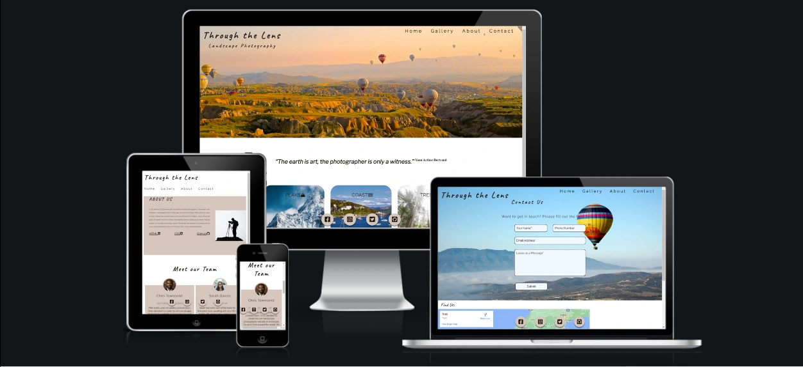
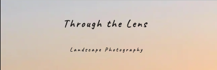
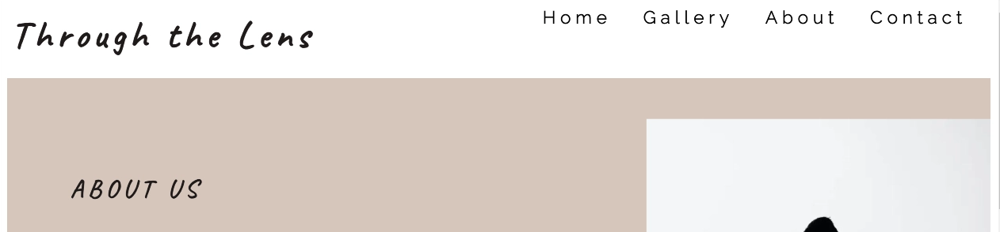
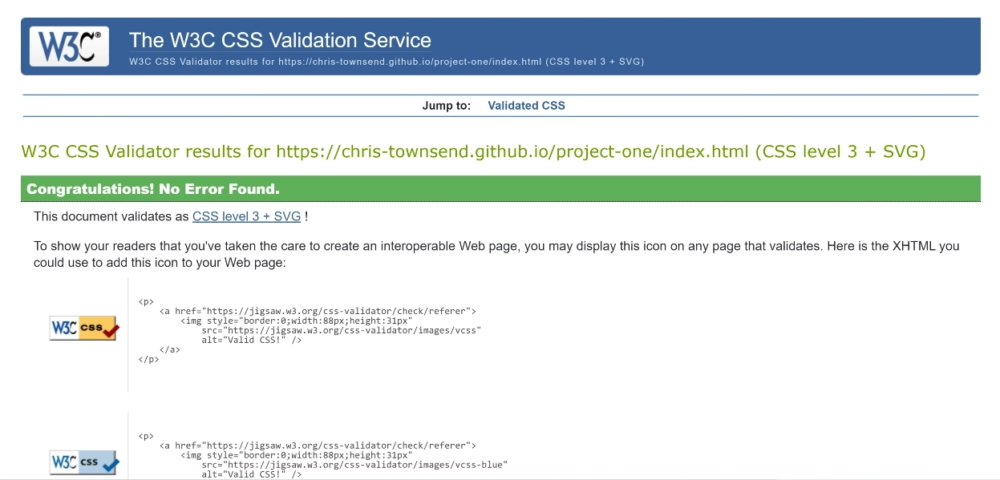
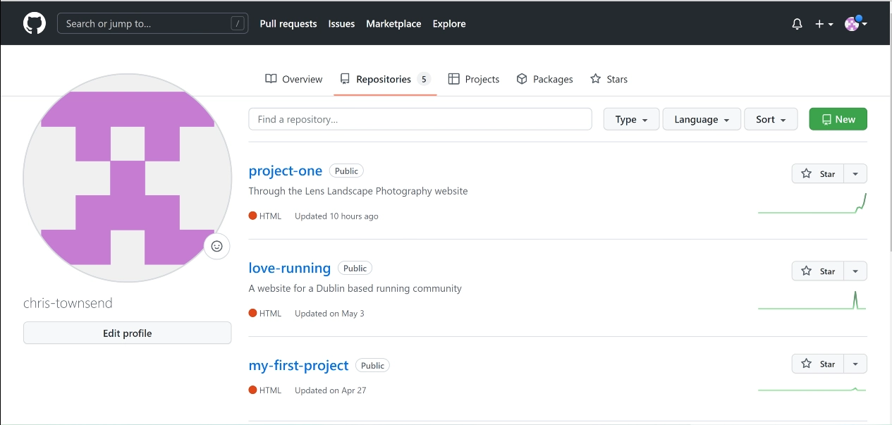

<h1 align="center">Portfolio Project One - HTML/CSS Essentials</h1>

## Live Site
[Through the Lens - Landscape Photography](https://chris-townsend.github.io/project-one/index.html)


## Repository
[https://github.com/chris-townsend/project-one](https://github.com/chris-townsend/project-one)

***

## Objective
In this project I intend to provide a portfolio style website to showcase some of the best Landscape photography prints. The main objective is to demonstrate competency in HTML and CSS. I hope to provide an emotive, static front end application which is clearly laid out and easy to navigate. 

**The needs within this project are not genuine and is made only for the purpose of completing my Code Institute PP1 project**

***

## Brief
- The goal of the website is to showcase Chris's landscape photography prints with the potential for users to contact the publisher if neccesary by using the contact form provided
- The website will have an about page which contains infomation about the author and also a team section
- Display a small gallery
- Links to wiki pages to show information on how the website was created by using HTML, CSS & GitHub 
- Fixed social media links at the bottom of the screen to attract returning viewers




***


## User Experience (UX)

-   ### User Requirements

    -   #### First Time Visitor Goals

        1. As a First Time Visitor, I want to easily understand the main purpose of the site and learn more about the organisation.
        2. As a First Time Visitor, I want to be able to easily navigate throughout the site to find content.
        3. As a First Time Visitor, I want to look for testimonials to understand what their users think of them and see if they are trusted. I also want to locate their social media links to see their followings on social media to determine how trusted and known they are.

    -   #### Returning Visitor Goals

        1. As a Returning Visitor, I want to find the best way to get in contact with the organisation with any questions I may have by using the contact page.
        2. As a Returning Visitor, I want to find social links.

    -   #### Frequent User Goals

        1. As a Frequent User, I want to check to see if there has been any new images uploaded.
       
    ***

-   ### Design
    -   #### Colour Scheme
        -   The two main colours used are Black and white with the homepage and contact page containing a hero image.

    I kept the colour scheme neutral to give the website a formal and professional look. The absence of any color allows better focus on the main content without any distracting elements. 

    ***
    -   #### Typography
    The fonts are imported into the CSS file from *[Google Fonts](https://fonts.google.com/)* 
    - The **Raleway** font is the main font used throughout the whole website with **Sans Serif** as the fallback font in case for any reason the font isn't being imported into the site correctly. **Raleway** is an elegent **sans-serif** typeface family which makes the text look bold and personable.
    
    - For the main headings I have used the **Caveat** font, with **Sans Serif** as a fallback font. Its a hand-writing type family which gives the website a friendly appearence.
    

    ***
         
    -   #### Imagery
        -   Imagery is important through out the website, especially on the homepage and gallery page. The large, background hero image is designed to be striking and catch the user's attention when they first vist the site. It has a modern and bright aesthetic. All of the images have been compressed using *[Compressor.io](https://compressor.io/)* to reduce size and load times.
    
    ***

*   ### Wireframes

    -   Home Page Wireframe - [View](https://github.com/)

    -   Mobile Wireframe - [View](https://github.com/)

    -   Contact Us Page Wireframe - [View](https://github.com/)

***    

## Features

-   Responsive on most device sizes

The design is made with mobile first in mind, the media queries in the CSS file are done in a way to keep the structure and responsiveness in place as the screen size decreases. 

I have used [Responsinator](http://www.responsinator.com/) to check the responsiveness on different devices. The site is responsive on all devices available inluding ios devices. I have also added extra media queries for screen sizes 360px wide. 

 - [Responsinator Results](http://www.responsinator.com/?url=chris-townsend.github.io%2Fproject-one%2Findex.html)
#
-   Interactive elements

1. I have tried to make the majority of the site **interative**. When you first arrive on the homepage, the main headings "Through the Lens and "Landscape Photography" flash up and grow on the screen over 1.5 seconds. This has been accomplished by using *keyframes* with *image-grow*.



2. The navigation bar at the top of the page has been made **interative** by using the *hover* function, this allows users to easily navigate the site.

    

3. The quote box below the hero image on the homepage has added **animation**, it grows from a scale of 0.2 to 1 over 8 seconds. I made the **animation** to grow over 8 seconds so that it gives readers a chance to scroll down the page before the **animation** is over. 


4. Below the quote section on the homepage is three gallery cards which take you to the gallery page when clicked. When you *hover* over the cards they become **interative**, this has been accomplished by using the *hover*: *transform* function.


5. The social media icons that have been fixed to the bottom of the screen have been made **interative** by using the *hover*: *transform* function. I have used a background colour and box shadow for when an icon is hovered over. Each icon has been assigned its own personal color by using [Social Colours](https://materialui.co/socialcolors/).


6. The headings for the gallery, about and contact page have been made **interactive**. Similar to the main heading, I have used the *image-grow* *keyframes* function. 




7. I wanted to make my gallery images stand out by adding **animation**. I accomplished this by using the *hover* and *transition* function. When you *hover* over an image it eases in over 0.4 seconds and when you unselect, it goes back to its original state. I used the *transition* ease-in-out for this method.


8. My contact page has been made **interative** so that when you input your details into the form, the headings get pushed out of the box and stay above the input boxes. This was accomplished by using the *hover* and *transition* function. I have added extra style to the submit button by adding in an arrow when you *hover* over it. The form will come up with a "Please fill out this feild" message when it hasn't been filled in correctly. This means that an email address is *required* before the form can be submitted. 


- *the contact form is **not currently active** as it requires languages I have yet to learn. The form is there to demonstrate the html structure and CSS style*

***

## Technologies Used

### Languages Used

-   [HTML5](https://en.wikipedia.org/wiki/HTML5)
-   [CSS3](https://en.wikipedia.org/wiki/Cascading_Style_Sheets)

### Frameworks, Libraries & Programs Used

- [Balsamiq:](https://balsamiq.com/)
    - Balsamiq was used to create the wireframes during the design process.

- [Pixlr:](https://pixlr.com/x/)
    - Pixlr was used to resize and change the format of my images.

- [TinyPNG:](https://tinypng.com/)
    - All images within the project have been processed through their free compression tool.

- [Hover.css:](https://ianlunn.github.io/Hover/)
    - Hover.css was used on the Social Media icons in the footer to add the float transition while being hovered over.

- [Google Fonts:](https://fonts.google.com/)
    - Google fonts were used to import the 'Raleway' and 'Caveat' font into the style.css file which is used on all pages throughout the project.

- [Font Awesome:](https://fontawesome.com/)
    - Font Awesome was used throughout the website to add icons for aesthetic and UX purposes.

- [Google DevTools:](https://developer.chrome.com/docs/devtools/)
    - Once the website was made to a basic deployment level, Google DevTools was used frequently to resize objects within the site, very helpful for making my website responsive.

- [Git](https://git-scm.com/)
    - Git was used for version control by utilizing the Gitpod terminal to commit to Git and Push to GitHub.

- [GitHub:](https://github.com/)
    - GitHub is used to store the projects code after being pushed from Git.

- [W3C Markup Validator:](https://validator.w3.org/)
    - This site was used to ensure that my HTML and CSS was error free. I had to push my code to ensure it was updated and then add the URL of the website to the address bar which then checked for errors or warnings.


## Testing

The W3C Markup Validator and W3C CSS Validator Services were used to validate every page of the project to ensure there were no syntax errors in the project.

-   [W3C HTML Markup Validator](https://validator.w3.org/) Results


-   [W3C CSS Markup Validator](https://jigsaw.w3.org/css-validator/) Results




### Testing User Stories from User Experience (UX) Section

-   #### First Time Visitor Goals

    1. As a First Time Visitor, I want to easily understand the main purpose of the site and learn more about the organisation.

        1. Upon entering the site, users are automatically greeted with a clean and easily readable navigation bar to go to the page of their choice. Underneath there is a Hero Image with Text and a "Learn More" Call to action button.
        2. The main points are made immediately with the hero image
        3. The user has two options, click the call to action buttons or scroll down, both of which will

    2. As a First Time Visitor, I want to be able to easily be able to navigate throughout the site to find content.

        1. The site has been designed to be fluid and never to entrap the user. At the top of each page there is a clean navigation bar, each link describes what the page they will end up at clearly.
        2. On the Contact Us Page, after a form response is submitted, the page refreshes and the user is brought to the top of the page where the navigation bar is.

    3. As a First Time Visitor, I want to look for testimonials to understand what their users think of them and see if they are trusted. I also want to locate their social media links to see their following on social media to determine how trusted and known they are.
        1. The user can also scroll to the bottom of any page on the site to locate social media links in the footer.
        2. At the bottom of the Contact Us page, the user is told underneath the form, that alternatively they can contact the organisation on social media which highlights the links to them.

-   #### Returning Visitor Goals


    1. As a Returning Visitor, I want to find the best way to get in contact with the organisation with any questions I may have.

        1. The navigation bar clearly highlights the "Contact Us" Page.
        2. Here they can fill out the form on the page or alternatively they can message the organisation on social media.
        3. The footer contains links to the organisations Facebook, Twitter and Instagram page as well as the organization's Github.
        4. Whichever link they click, it will be open up in a new tab to ensure the user can easily get back to the website.
        5. The email button is set up to automatically open up your email app and autofill there email address in the "To" section.

    2. As a Returning Visitor, I want to find the Facebook Group link so that I can join and interact with others in the community.
        1. The Facebook Page Icon is fixed to the bottom of the screen on every page and will open a new tab for the user and more information can be found on the Facebook page.

-   #### Frequent User Goals

    1. As a Frequent User, I want to check to see if there are any newly added images 

        1. The user would already be comfortable with the website layout and can easily click the gallery page.

        2. As a Frequent User, I want to check where the location is.

        3. The user would already be comfortable with the website layout and can easily click the contact link from the homepage and at the bottom of the page is a google map.

    2. As a Frequent User, I want to get hold of the organization by using there contact form on the contact page. 
        1. At the top of every page their is a nav bar which content is consistent throughout all pages.
        2. There is a "Submit" button to the bottom of the input field. This is located close to the field and can easily be distinguished. When you hover over the button some arrows appear to acknowedge you are about to submit the form.

### Further Testing

-   The Website was tested on Google Chrome, Internet Explorer, Microsoft Edge and Safari browsers.
-   The website was viewed on a variety of devices such as Desktop, Laptop, Oneplus 5t, iPhone SE, iPhone 6-8, iPhoneX & Samsung Galaxy S21
-   A large amount of testing was done to ensure that all pages were linking correctly.
-   Friends and family members were asked to review the site and documentation to point out any bugs and/or user experience issues.

### Known Bugs

-   On some small mobile devices the contact map pushes the size of screen out more than any of the other content on the page.
    -   A white gap can be seen to the right and above the map.
-   On Microsoft Edge and Internet Explorer Browsers, all links in Navbar are pushed upwards when hovering over them.

## Deployment
***

### GitHub Pages

The project was deployed to GitHub Pages using the following steps...

1. Log in to GitHub and locate the [GitHub Repository](https://github.com/)


2. At the top of the Repository, locate the "Settings" Button on the menu.
    

3. Select "Pages" from the menu on the left-hand side.

    

4. Under "Source", click the dropdown bar and select "Main Branch" and click save.


5. The page will automatically refresh and will take a short time to publish the page. The page should turn green once the site has been deployed.


6. Scroll back down through the page to locate the now published site [link](https://github.com) in the "GitHub Pages" section.


### Forking the GitHub Repository

By forking the GitHub Repository we make a copy of the original repository on our GitHub account to view and/or make changes without affecting the original repository by using the following steps...

1. Log in to GitHub and locate the [GitHub Repository](https://github.com/)
2. At the top of the Repository (not top of page) just above the "Settings" Button on the menu, locate the "Fork" Button.
3. You should now have a copy of the original repository in your GitHub account.

### Making a Local Clone

1. Log in to GitHub and locate the [GitHub Repository](https://github.com/)
2. Under the repository name, click "Clone or download".
3. To clone the repository using HTTPS, under "Clone with HTTPS", copy the link.
4. Open Git Bash
5. Change the current working directory to the location where you want the cloned directory to be made.
6. Type `git clone`, and then paste the URL you copied in Step 3.

```
$ git clone https://github.com/YOUR-USERNAME/YOUR-REPOSITORY
```

7. Press Enter. Your local clone will be created.

```
$ git clone https://github.com/YOUR-USERNAME/YOUR-REPOSITORY
> Cloning into `CI-Clone`...
> remote: Counting objects: 10, done.
> remote: Compressing objects: 100% (8/8), done.
> remove: Total 10 (delta 1), reused 10 (delta 1)
> Unpacking objects: 100% (10/10), done.
```

Click [Here](https://help.github.com/en/github/creating-cloning-and-archiving-repositories/cloning-a-repository#cloning-a-repository-to-github-desktop) to retrieve pictures for some of the buttons and more detailed explanations of the above process.

## Credits

### Code

-   The full-screen hero image code came from this [StackOverflow post](https://stackoverflow.com)

-   [Bootstrap4](https://getbootstrap.com/docs/4.4/getting-started/introduction/): Bootstrap Library used throughout the project mainly to make site responsive using the Bootstrap Grid System.

-   [MDN Web Docs](https://developer.mozilla.org/) : For Pattern Validation code. Code was modified to better fit my needs and to match an Irish phone number layout to ensure correct validation. Tutorial Found [Here](https://developer.mozilla.org/en-US/docs/Web/HTML/Element/input/tel#Pattern_validation)

### Content

-   All content was written by the developer.

-   Psychological properties of colours text in the README.md was found [here](http://www.colour-affects.co.uk/psychological-properties-of-colours)

### Media

-   All Images were created by the developer.

### Acknowledgements

-   My Mentor for continuous helpful feedback.

-   Tutor support at Code Institute for their support.